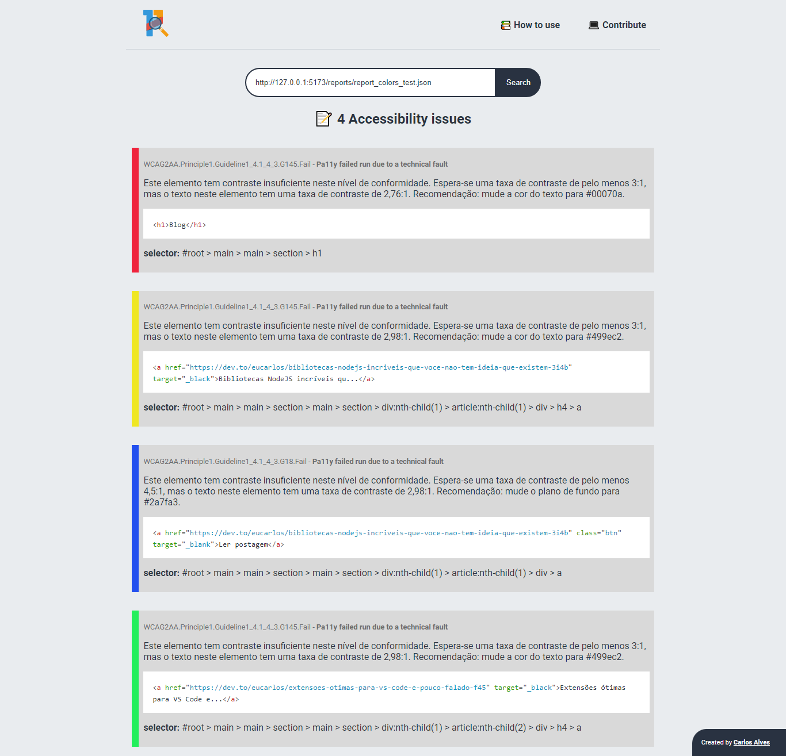

# Pa11y Viewer

<p align="center">
    <br/>
    Um projeto de código aberto que carrega relatórios Pa11y no formato JSON e destaca quaisquer problemas de acessibilidade encontrados.<br/></br>
    
    <br/></br>
    <a href="https://github.com/EuCarlos/pa11y-viewer#installation">Instalar localmente</a> |
    <a href="https://github.com/EuCarlos/pa11y-viewer/wiki/Pa11y-Viewer:-How-to-Use">Como usar</a> | 
    <a href="https://github.com/EuCarlos/pa11y-viewer#how-to-contribute-to-this-project">Como contribuir</a>
</p>

## Demostração:
<p align="center">

</p>

## Instalação:
Clone o repositório e instale as dependências usando o Yarn:
```bash
git clone https://github.com/EuCarlos/pa11y-viewer.git \
  && cd pa11y-viewer \
  && yarn install
```
### Execute o projeto

```bash
yarn dev
```

## Como contribuir com este projeto?
Antes de começar, verifique e siga as instruções para contribuir com o repositório. Se não, você pode seguir as instruções abaixo:

1. Fork o projeto
2. Crie um novo branch: git checkout -b nova-branch
3. Confirme suas alterações: git commit -m 'Adicionei algo'
4. Push para branch: git push origin nova-branch
5. Abra uma Pull Request

## Como faço para relatar um bug ou solicitar um recurso?
Se você quiser relatar um bug ou solicitar um recurso, vá para [Issue](https://github.com/eucarlos/pa11y-viewer/issues) do projeto no GitHub e adicione sua solicitação.

___

<p align="center">
Criado com 💜 por <a href="https://github.com/eucarlos/">Carlos Alves</a></p>
